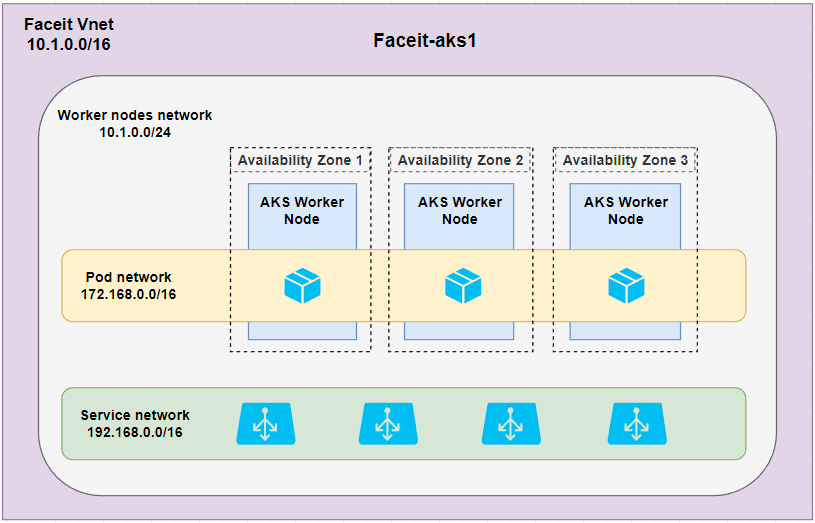
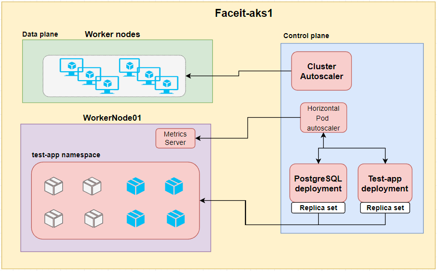
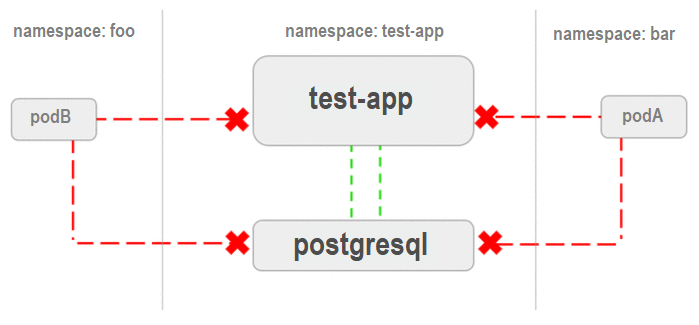

# Solution

This solution consist basically on Azure as the cloud provider and AKS as a managed Kubernetes instance to deploy our applications. Terraform is included to automate the process to provision the entire infrastructure.

Azure AKS is a managed Kubernetes product with native capabilities such as high-availability, scalability, service discovery, self-healing, etc, and fits well the requirements for this project and for future projects. AKS integrates easily with Azure services such as Load-balancing, storage, databases, etc, reducing the complexity to create workflows and the operational overhead of managing the cluster by offloading much of that responsibility to Azure.

# Requirements
To replicate this project the following list are required: 

- Azure account (free tier is ok)
- Azure CLI
- Azure Service Principal
- Terraform

### Service Principal

Automated tools that deploy or use Azure services - such as Terraform - should always have restricted permissions. Instead of having applications sign in as a fully privileged user, we will use service principals. To create it, we can do it using Azure CLI or interactively sign in to Azure and create a service principal.

Provision via Azure CLI:
```bash
az login
az ad sp create-for-rbac --name devops-challenge-sp --role Contributor --scopes /subscriptions/<subscription_id>
```
Make note of the appId, display_name, password, and tenant.

### Terraform remote backend

Terraform tracks state locally via the terraform.tfstate file. This pattern works well in a single-person environment. However, in a more practical multi-person environment, we need to track state on the server using a remote storage. We will use Azure storage account with a storage container to store the terraform state. It nativaly contains data-protection (recovery, versioning) and redundancy. Data stored there is encrypted before being persisted. When needed, Terraform retrieves the state from the backend and stores it in local memory. Using this pattern, state is never written to your local disk.

I have written a manifest to provision the backend using Terraform. It will create a resource group, a storage account with a blob container. Note that it will create a local state file as we still don't have a proper remote backend.

Repository structure:
[Remote Backend](./terraform/backend/create-remote-storage.tf)
```
devops-challenge:
          └─── terraform
               └─── backend
                   └─── create-remote-storage.tf
```

For the exercise, Terraform states were divided based on the type of resources, so each of them can be maintainable separately:
```
azure/faceit-challenge/aks.tfstate - AKS cluster infrastructure and related resources
azure/faceit-challenge/acr.tfstate - container registry - Azure container registry
azure/faceit-challenge/app.tfstate - AKS applications and related resources
```
### Cluster setup

Ensuring high availability of deployments is a must for enterprise workloads. Kubernetes cluster is deployed using 3 availability zones providing high availability and application resiliency by distributing worker nodes across multiple zones within a single region. It protects resources from data center-level failures by distributing them across one or more data centers in an Azure region. 
Network space is designed to have a subnet for worker nodes pool and different internal subnets for PODs and services.



Also, AKS uses cluster autoscaler component to watch for pods that can't be scheduled because of resource constraints and increase the number of worker nodes in the node pool automatically and decrease when it is not needed anymore. For PODs, kubernetes supports horizontal pod autoscaling to adjust the number of pods in a deployment depending on resource utilization or other select metrics.



# Infrastructure deployment

## Container registry

A private container registry was provisioned via Terraform to store the  test-app container image.

Repository structure:
[Container Registry](./terraform/infrastructure/registry/container-registry.tf)
```
devops-challenge:
         └─── terraform
              ├─── backend
              └─── infrastructure
                   └─── registry
                        └─── container-registry.tf
```

## Cluster

The cluster is configured to have a single worker node group with a configurable number of nodes and VM size. Node group by default uses instance size 'Standard_D2_v2' and a single worker node.

Repository structure:
[Cluster](./terraform/infrastructure/cluster)
```
devops-challenge:
          ├── terraform
              ├─── backend
              └─── infrastructure
                   └─── charts
                   └─── cluster
                        └─── cluster.tf
                        └─── network.tf
```

## Kube-config
After cluster provision, get kube-config using the following Azure CLI command:
```
az aks Get-Credentials --resource-group faceit-rg --name faceit-aks --file ~/.kube/config
```

# Application deployment
Application deployments are done using helm charts to make easier the deployment of all needed kubernetes resources for each application. All application's related are deployed into a namespace and only comunication between internal components will be allowed, except DNS traffic with kube-system namespace.



## PostgreSQL
The installation uses the official helm chart and the instance is configured with replication architecture model using read-only replicas. Horizontal POD autoscalling is defined for PostgreSQL-primary and read-only Pods based on CPU Utilization percentage. Database parameters are included as terraform sensitive variables. 

## Test-app
A helm chart was created from scratch using the built-in container image from a Dockerfile on the application folder. The image is tagged as 'faceitregistry.azurecr.io/test-app:1.0.0 and pushed to the private Azure container registry. For high-availability, application has a minimum of 3 replicas with anti-affinity rule to avoid scheduling pods in the same worker node. Horizontal POD autoscalling is defined based on CPU Utilization percentage and can scale up to 10 pods. For security purpose, POD runs as a normal user, aka non-root, with read only permissions for the root filesystem and all capabilities removed.

DB sensitive data is stored in secrets and mapped as environment variables on pod.

## Release process

A CI process would start into repository with a pushing code. It should trigger a pipeline to test the integrated code, security code test, etc. If all passed, merge code and built a new container image with new tag and push to a container registry. 
For a CD process, it would start testing this new image in a test environment and perform tests. If the deploys is successfull we can deploy to production. Kubernetes deployments can use Rolling Update policy, that permits a zero downtime deployment by incrementally updating pods instances with new ones. In association with health checks, we should not suffer any outage downtime and the service will turn the traffic when the new pod is ready.

## Monitoring

For stack selected is Prometheus to polling metrics endpoints, Alertmanager as the alerting layer of the stack, Grafana as data visualisation with dashboards and graphs and node-exporter to collect data on cluster nodes and provides OS an hardware metrics. The installation is based on Prometheus Operator


---------------------
# FACEIT DevOps Challenge

You have been asked to create the infrastructure for running a web application on a cloud platform of your preference (Google Cloud Platform preferred, AWS or Azure are also fine).

The [web application](test-app/README.md) can be found in the `test-app/` directory. Its only requirements are to be able to connect to a PostgreSQL database and perform PING requests.    

The goal of the challenge is to demonstrate hosting, managing, documenting and scaling a production-ready system.

This is not about website content or UI.

## Requirements

- Deliver the tooling to set up the application using Terraform on the cloud platform of your choice (free tiers are fine)
- Provide basic architecture diagrams and documentation on how to initialise the infrastructure along with any other documentation you think is appropriate
- Provide and document a mechanism for scaling the service and delivering the application to a larger audience
- Describe a possible solution for CI and/or CI/CD in order to release a new version of the application to production without any downtime

Be prepared to explain your choices

## Extra Mile Bonus (not a requirement)

In addition to the above, time permitting, consider the following suggestions for taking your implementation a step further:

- Monitoring/Alerting
- Implement CI/CD (github actions, travis, circleci, ...)
- Security

## General guidance

- We recommend using this repository as a starting point, you can clone it and add your code/docs to that repository
- Please do no open pull request with your challenge against **this repository**
- Submission of the challenge can be done either via your own public repository or zip file containing `.git` folder

